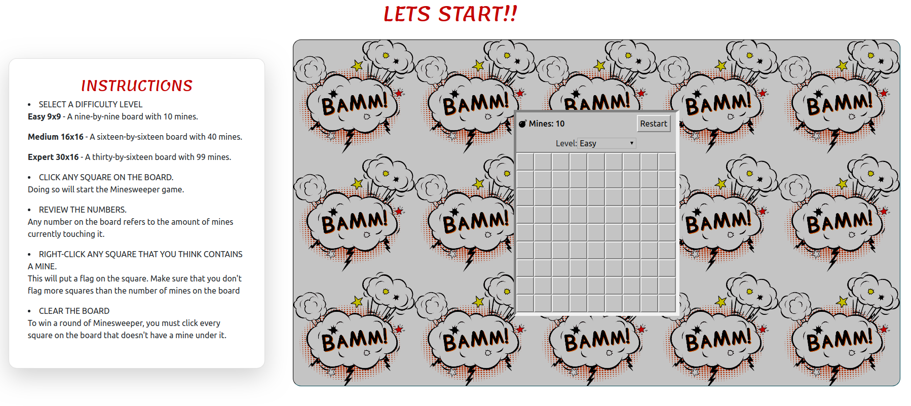

# Welcome to Minesweeper!

## install dependencies'

For the very first time, run `npm i` to install dependencies.

## Start the game'

Run `npm start`  to run the game. 
Head over to [http://localhost:3000](http://localhost:3000) to enjoy!

Ladies and gentlemen, let the 74th Hunger Games begin, and may the odds be ever in your favor!

## P.S. 
If you have any problems with "babel-eslint" please create an `.env` file and add `SKIP_PREFLIGHT_CHECK=true` to it.

